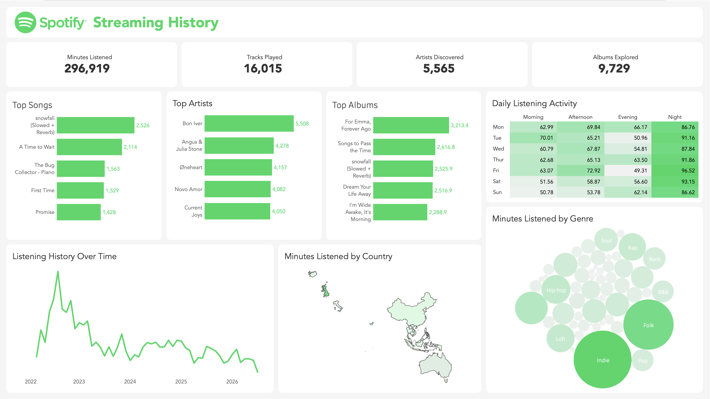
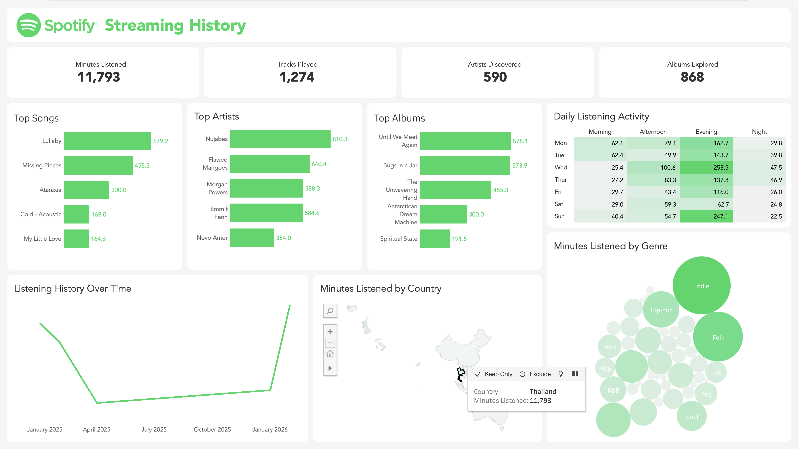

    

# Streaming History Dashboard

### 📌 Project Overview
#
An end-to-end data analytics project that uses an ELT pipeline to process and analyse personal Spotify streaming history data on Tableau. This project covers a complete analytics workflow from data extraction, loading and transforming in a database, and dashboard development. 
 
The interactive dashboard is available on <a href="https://public.tableau.com/views/SpotifyDashboard_17842213345050/SpotifyDashboard?:language=en-GB&:sid=&:redirect=auth&:display_count=n&:origin=viz_share_link">Tableau Public</a>.

### 📷 Examples
#
**Original View:** 
 
 
 
**Filtered View:** 
 

### 🎯 What I Learned
#
- Used Python to read and concatenate multiple JSON files into a single dataframe.
- Learned how to set up and configure a PostgreSQL server.
- Improved my understanding of data warehousing by implementing a star schema using SQL to create fact and dimension tables.
- Gained experience with developing interactive dashboards on Tableau.

### 📝 Notes
#
- All data prior to 2022 was removed, as there were significant gaps of streaming history data between 2016 and 2022 which impacted the visualisation on Tableau. This excluded 61 rows totalling 49 minutes of listening activity recorded before the Spotify Premium subscription started in 2022.

### 📄 Credits
#
**Author:** Evan Nartea 
**Contributors:** Evan Nartea 
 
Spotify data: Spotify → Account → Security and privacy → Account privacy → Download your data → Extended streaming history 
Genre data: https://www.last.fm/api/show/artist.getTopTags 
